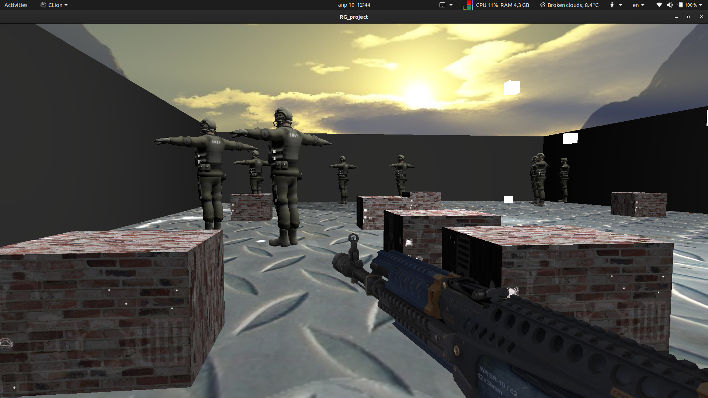

# Target_Shooting

**Projekat iz Racunarske grafike koji sadrzi scenu, pucaca , prostoriju sa dodatnim figurama, i osvetljenje.**

## Setup :pencil2:
1.Prvo je potrebno klonirati repozitorijum: ``` $ git clone https://github.com/lukamileticc/RG_project ```

2. CLion->open->path_to_project
3. U glavnom repozitorijumu se nalazi main.cpp
4. ALT+SHIFT+F10 -- precica za pokretanje projekta

Potrebne biblioteke:
```
$ sudo apt-get install g++ cmake git build-essential libgl1-mesa-dev libsoil-dev libglm-dev libassimp-dev libglew-dev libglfw3-dev libxinerama-dev libxcursor-dev libxi-dev mesa-common-dev mesa-utils libxxf86vm-dev libfreetype6-dev
```

## Screenshots :dart:




## Controls :selfie:  
- ```w``` kretanje unapred
- ```s``` kretanje unazad
- ```a``` rotacija u levo
- ```d``` rotacija u desno
- ```f``` ukljucivanje spotlight svetla(lampe)
- ```shift``` brzo hodanje
- ```space``` skakanje
- ```ctrl``` cucenje
- ```b``` ukljucivanje advance lighting
- ```esc``` izlaz

## Teme ##
Iz oblasti A uradjena je teba CUBEMAPS.

## Models ##
Modeli su preuzeti sa stranica https://sketchfab.com/3d-models/.


## Developer :punch: :muscle:

- [Luka Miletić, 91/2017](https://gitlab.com/lukamileticc) :man:
